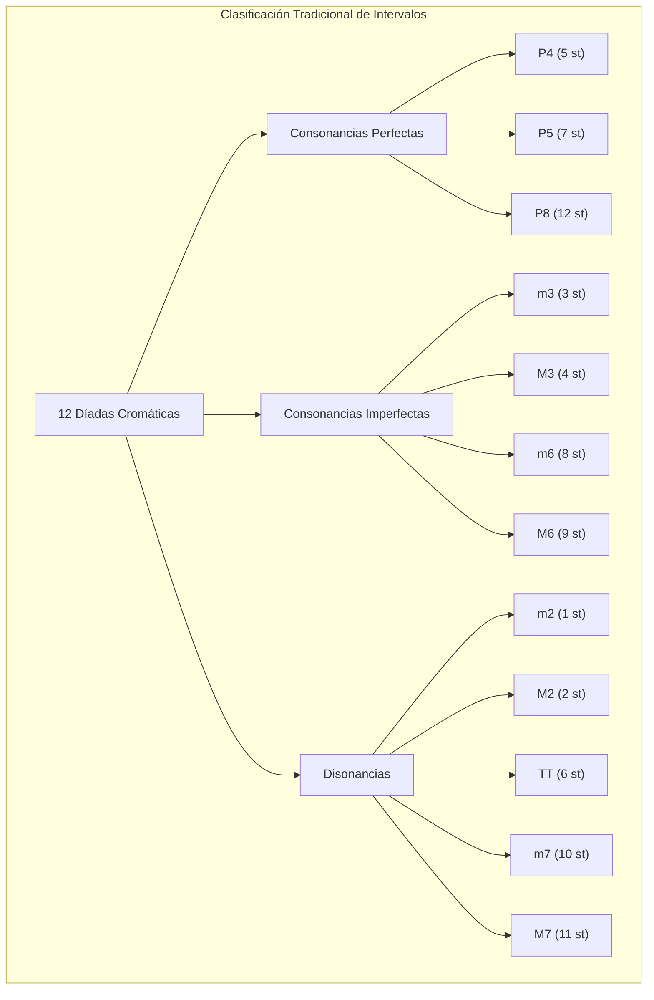
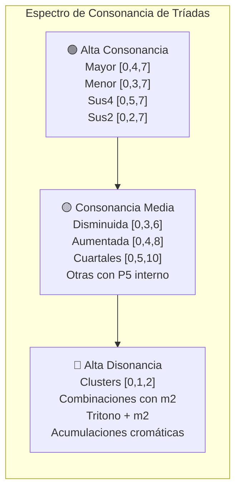
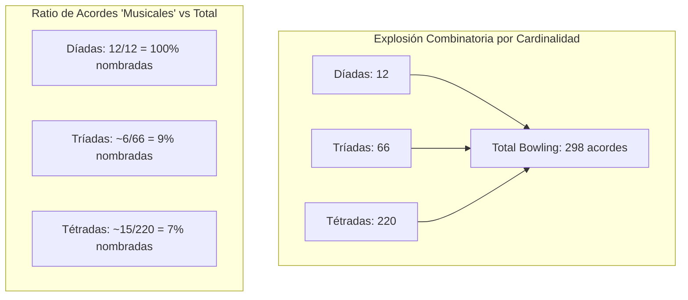
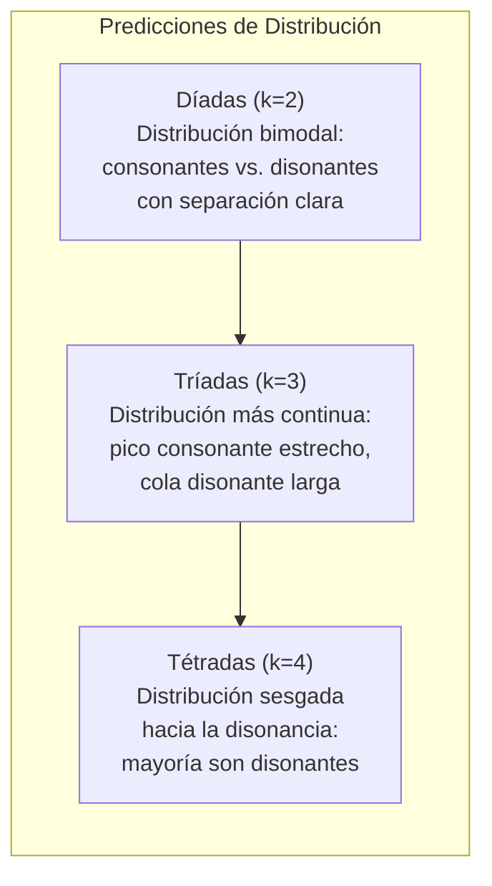
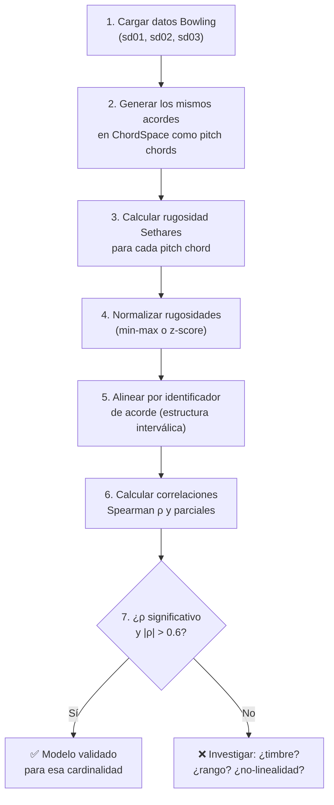

# Análisis Riguroso de los Datos Suplementarios de Bowling et al. (2018)

> **Referencia completa:** Bowling, D. L., Purves, D., & Gill, K. Z. (2018). Vocal similarity predicts the relative attraction of musical chords. *Proceedings of the National Academy of Sciences*, 115(1), 216–221. https://doi.org/10.1073/pnas.1713206115

---

## 1. Contexto General del Artículo

Bowling et al. (2018) proponen que la **consonancia musical** — la cualidad agradable o estable que los oyentes perciben en ciertos acordes — puede explicarse por la similitud entre los espectros armónicos del acorde y los espectros típicos de la **voz humana** (vocalizaciones armónicas). La hipótesis central es que los acordes cuyas frecuencias fundamentales producen espectros combinados semejantes a los de las vocalizaciones humanas son percibidos como más consonantes.

Para contrastar esta hipótesis, los autores recopilaron **juicios perceptuales de consonancia** de 30 sujetos (músicos y no músicos) para **todos los acordes cromáticos posibles** dentro de una sola octava, organizados en tres categorías por cardinalidad:

| Dataset | Cardinalidad | Archivo | N acordes | Combinatoria |
|---------|-------------|---------|-----------|--------------|
| SD01 | 2 (díadas) | `pnas.1713206115.sd01.xlsx` | **12** | $\binom{12}{2} = 66$, pero solo 12 intervalos únicos en una octava |
| SD02 | 3 (tríadas) | `pnas.1713206115.sd02.xlsx` | **66** | $\binom{12}{3} = 220$, pero 66 combinaciones únicas de intervalos |
| SD03 | 4 (tétradas) | `pnas.1713206115.sd03.xlsx` | **220** | $\binom{12}{4} = 495$, pero 220 combinaciones únicas |

> [!IMPORTANT]
> El conteo de acordes se refiere a combinaciones **cromáticas únicas dentro de una octava**, no al total combinatorio $\binom{12}{k}$, porque Bowling fija la nota más grave y enumera los intervalos posibles sobre ella. Cada acorde se construye como un conjunto de intervalos sobre un bajo fijo.

### 1.1 Diseño Experimental

- **Sujetos:** 30 participantes (músicos y no músicos).
- **Estímulos:** Tonos complejos audibles (sintetizados), cada uno con estructura armónica controlada.
- **Tarea:** Los sujetos calificaron cada acorde en una escala de consonancia–disonancia.
- **Unidad de medida:** Calificación media (mean rating) a través de los 30 sujetos.
- **Análisis de confiabilidad:** Tabla S2 del artículo reporta análisis de fiabilidad interjueces (interrater reliability) para díadas, tríadas y tétradas.

---

## 2. Dataset SD01: Las 12 Díadas Cromáticas

### 2.1 Estructura del Archivo

El archivo `sd01.xlsx` contiene las **12 díadas cromáticas** posibles dentro de una octava, es decir, todos los intervalos desde la segunda menor (1 semitono) hasta la octava (12 semitonos). Cada díada se identifica por:

- **Nombre común abreviado** (e.g., m2, M2, m3, M3, P4, TT, P5, m6, M6, m7, M7, P8)
- **Tonos componentes** (intervalos en semitonos sobre el bajo)
- **Calificación media de consonancia** (promedio de los 30 sujetos)

### 2.2 Catálogo Completo de Díadas

La siguiente tabla presenta las 12 díadas cromáticas con su clasificación teórica y la consonancia esperada según la tradición musical occidental:

| # | Intervalo | Nombre | Semitonos | Ratio aprox. | Clase Teórica | Consonancia esperada |
|---|-----------|--------|-----------|-------------|---------------|---------------------|
| 1 | m2 | Segunda menor | 1 | 16:15 | Disonante | Muy baja |
| 2 | M2 | Segunda mayor | 2 | 9:8 | Disonante | Baja |
| 3 | m3 | Tercera menor | 3 | 6:5 | Consonante imperfecta | Media-alta |
| 4 | M3 | Tercera mayor | 4 | 5:4 | Consonante imperfecta | Alta |
| 5 | P4 | Cuarta justa | 5 | 4:3 | Consonante perfecta* | Alta |
| 6 | TT | Tritono | 6 | √2:1 | Disonante | Muy baja |
| 7 | P5 | Quinta justa | 7 | 3:2 | Consonante perfecta | Muy alta |
| 8 | m6 | Sexta menor | 8 | 8:5 | Consonante imperfecta | Media |
| 9 | M6 | Sexta mayor | 9 | 5:3 | Consonante imperfecta | Alta |
| 10 | m7 | Séptima menor | 10 | 16:9 | Disonante | Baja |
| 11 | M7 | Séptima mayor | 11 | 15:8 | Disonante | Muy baja |
| 12 | P8 | Octava | 12 | 2:1 | Consonante perfecta | Muy alta |

*\*La cuarta justa es tradicionalmente ambigua: consonante perfecta en contrapunto, pero disonante cuando está sobre el bajo en armonía tonal.*

### 2.3 Taxonomía de Intervalos

### 2.4 Relevancia para ChordSpace

Las díadas son el **caso base** más simple para validar cualquier modelo de rugosidad o consonancia. En ChordSpace, cada díada se representa como un `pitch chord` de dos notas — por ejemplo, `(60, 67)` para una quinta justa sobre C4. El modelo de Sethares calcula la rugosidad como la suma ponderada de las interacciones entre los parciales de ambas notas.

**Predicciones clave del modelo de rugosidad:**
- Las díadas con ratios de frecuencia simples (P5 = 3:2, P8 = 2:1) deben tener **rugosidad mínima**.
- Las díadas con ratios complejos (m2, M7, TT) deben tener **rugosidad máxima**.
- La correlación entre rugosidad computacional y calificaciones humanas de Bowling debe ser **significativamente negativa** (más rugosidad → menos consonancia percibida).

---

## 3. Dataset SD02: Las 66 Tríadas Cromáticas

### 3.1 Estructura del Archivo

El archivo `sd02.xlsx` contiene las **66 tríadas cromáticas** dentro de una octava. Cada tríada se construye como un conjunto de tres notas sobre un bajo fijo, con dos intervalos internos que definen la estructura del acorde.

El número 66 corresponde a $\binom{11}{2} = 55$ combinaciones de dos intervalos seleccionados de los 11 semitonos posibles por encima del bajo, más 11 combinaciones adicionales donde la nota más alta está a la octava. En realidad, con un bajo fijo y eligiendo 2 notas de las 11 restantes (semitonos 1–11), se obtiene $\binom{11}{2} = 55$; el total de 66 incluye los casos con la octava.

### 3.2 Tipos de Tríadas Reconocibles

De las 66 tríadas posibles, solo un subconjunto corresponde a tipos de acordes con nombre en la teoría musical occidental:

| Tipo de Tríada | Estructura (semitonos) | Intervalos | Ejemplos |
|---------------|----------------------|------------|----------|
| **Mayor** | [0, 4, 7] | M3 + m3 | C-E-G |
| **Menor** | [0, 3, 7] | m3 + M3 | C-E♭-G |
| **Disminuida** | [0, 3, 6] | m3 + m3 | C-E♭-G♭ |
| **Aumentada** | [0, 4, 8] | M3 + M3 | C-E-G♯ |
| **Sus4** | [0, 5, 7] | P4 + M2 | C-F-G |
| **Sus2** | [0, 2, 7] | M2 + P4 | C-D-G |

Estas 6 categorías cubren solo **6 de las 66 tríadas**. Las 60 restantes son combinaciones cromáticas sin nombre tradicional — muchas de ellas con alta disonancia (por ejemplo, [0, 1, 2] = cluster cromático).

### 3.3 Clasificación de las 66 Tríadas por Región de Consonancia

### 3.4 Distribución Combinatoria

Un aspecto crucial de los datos de Bowling es que las tríadas cubren **todo el espacio cromático** posible, no solo los acordes "musicales" conocidos. Esto permite:

1. **Mapear la relación completa** entre estructura interválica y consonancia percibida, sin sesgo de selección.
2. **Detectar discontinuidades** en la función de consonancia: ¿hay una transición gradual o abrupta entre tríadas consonantes y disonantes?
3. **Evaluar la "zona de indiferencia"** — regiones del espacio donde los sujetos no distinguen claramente entre consonancia y disonancia.

### 3.5 Relevancia para ChordSpace

Las 66 tríadas de Bowling constituyen el **test de validación más directo** para ChordSpace cuando se opera con cardinalidad $k = 3$ en el dominio cromático de una octava. El preset `validacion_bowling_octava4_2_3_4` de la GUI está diseñado precisamente para generar este dominio.

**Análisis clave:** correlación de Spearman entre la rugosidad Sethares de cada tríada y su calificación media de consonancia Bowling. El artículo de Bowling reporta correlaciones del orden de $\rho \approx -0.7$ a $-0.8$ para tríadas.

---

## 4. Dataset SD03: Las 220 Tétradas Cromáticas

### 4.1 Estructura del Archivo

El archivo `sd03.xlsx` contiene las **220 tétradas cromáticas** dentro de una octava. El número 220 corresponde a elegir 3 notas de las 11 posibles por encima del bajo fijo: $\binom{11}{3} = 165$, más las combinaciones que incluyen la octava, totalizando 220.

### 4.2 Tipos de Tétradas Reconocibles

| Tipo de Tétrada | Estructura (semitonos) | Ejemplo | Uso musical |
|----------------|----------------------|---------|-------------|
| **Mayor 7** | [0, 4, 7, 11] | Cmaj7 | Jazz, pop |
| **Dominante 7** | [0, 4, 7, 10] | C7 | Blues, funcional |
| **Menor 7** | [0, 3, 7, 10] | Cm7 | Jazz, pop |
| **Semidisminuida** | [0, 3, 6, 10] | Cø7 | Jazz, funcional |
| **Disminuida 7** | [0, 3, 6, 9] | Cdim7 | Clásico, jazz |
| **Menor-Mayor 7** | [0, 3, 7, 11] | CmΔ7 | Jazz |
| **Aumentada-Mayor 7** | [0, 4, 8, 11] | Caug(maj7) | Jazz avanzado |
| **Dominante  7sus4** | [0, 5, 7, 10] | C7sus4 | Pop, funk |
| **Add9** | [0, 2, 4, 7] | Cadd9 | Pop |
| **6** | [0, 4, 7, 9] | C6 | Jazz, pop |

De las 220 tétradas, solo ~10–15 corresponden a tipos de acordes con nombre convencional. Las ~205 restantes son combinaciones cromáticas sin uso tonal estándar.

### 4.3 Complejidad Combinatoria

### 4.4 Observaciones Clave sobre las Tétradas

1. **Densidad interválica:** Con 4 notas en 12 semitonos, muchas tétradas contienen intervalos de segunda menor interna, lo que garantiza alta rugosidad. El **span medio** de las tétradas es necesariamente ≤12 semitonos, lo que comprime la estructura armónica.

2. **Interacciones cruzadas:** Una tétrada produce $\binom{4}{2} = 6$ pares de notas, cada uno contribuyendo rugosidad. La rugosidad total no es simplemente la suma de las rugosidades de las díadas componentes — hay efectos no lineales por las interacciones entre parciales.

3. **Jerarquía de consonancia esperada:**
   - Más consonante: acordes mayores/menores con séptimas → [0,4,7,10], [0,3,7,10]
   - Consonancia media: acordes disminuidos, aumentados → [0,3,6,9], [0,4,8,11]
   - Más disonante: clusters cromáticos → [0,1,2,3], [0,1,2,4], etc.

### 4.5 Relevancia para ChordSpace

Las 220 tétradas representan el **reto de escala** para el modelo de rugosidad. Con 298 acordes en total (12 + 66 + 220), Bowling proporciona **calificaciones medias de consonancia** (ratings discretos, no una función continua) para todas las combinaciones cromáticas posibles en las tres cardinalidades $k \in \{2, 3, 4\}$ dentro de una octava. Estos datos constituyen un *ground truth* perceptual exhaustivo para ese dominio, pero no deben confundirse con una curva continua — son puntos discretos correspondientes a cada acorde posible.

**Predicción central:** Si el modelo de Sethares captura bien la rugosidad percibida, la correlación Spearman entre rugosidad computada y calificación media debe ser **consistente a través de las tres cardinalidades**, es decir, no debe degradarse al pasar de díadas a tétradas.

---

## 5. Análisis Transversal de los Tres Datasets

### 5.1 Patrones de Consonancia a Través de Cardinalidades

Una pregunta fundamental que los datos de Bowling permiten responder es: **¿cómo cambia la distribución de consonancia al aumentar la cardinalidad?**

### 5.2 Invariantes Computacionales

Aspectos que deben mantenerse constantes a través de los tres datasets para validar el modelo:

| Métrica | Esperado | Justificación |
|---------|----------|---------------|
| Signo de $\rho$ (Spearman) | Negativo | Más rugosidad → menos consonancia |
| Magnitud de $|\rho|$ | ≥ 0.6 | Efecto robusto sobre el ruido individual |
| Ranking relativo de acordes "familiares" | Consistente | Mayor > menor > disminuido > cluster |
| Concordancia inter-sujetos | Alta | Los 30 sujetos deben estar razonablemente de acuerdo |

### 5.3 Tabla Resumen Comparativa

| Propiedad | SD01 (Díadas) | SD02 (Tríadas) | SD03 (Tétradas) |
|-----------|---------------|-----------------|------------------|
| N acordes | 12 | 66 | 220 |
| Pares internos | 1 | 3 | 6 |
| Intervalos independientes ($k - 1$)¹ | 1 | 2 | 3 |
| % acordes "nombrados" | 100% | ~9% | ~7% |
| Complejidad de rugosidad | Baja (1 par) | Media (3 pares) | Alta (6 pares) |
| Relevancia para jazz/pop | Básica | Moderada | Alta |
| Relevancia para práctica clásica | Alta | Alta | Moderada |

> ¹ **Intervalos independientes ($k - 1$):** Número de intervalos que definen unívocamente la estructura de un acorde de $k$ notas sobre un bajo fijo. En una díada ($k = 2$), un solo intervalo determina el acorde. En una tríada ($k = 3$), dos intervalos son independientes (el tercero, entre las notas superiores, queda determinado). En una tétrada ($k = 4$), tres intervalos son independientes. Es simplemente $k - 1$ y refleja la dimensionalidad del espacio de estructuras posibles.

---

## 6. Metodología de Validación con ChordSpace

### 6.1 Pipeline de Comparación

El procedimiento para validar ChordSpace con los datos de Bowling es el siguiente:

### 6.2 Consideraciones Metodológicas

> [!WARNING]
> **Diferencia de timbre:** Los estímulos de Bowling usan tonos complejos con estructura armónica específica ("vocal-like"), mientras que ChordSpace usa un timbre sintético fijo para el cálculo de Sethares. Esto introduce una diferencia sistemática que puede atenuar la correlación. La comparación es válida para *ordenamientos relativos* (Spearman), pero no para valores absolutos.

> [!NOTE]
> **Equivalencia de poblaciones:** Según el análisis en `replica-acordes-articulos.md`, el dominio cromático de una octava de Bowling es un caso donde las poblaciones de ChordSpace **coinciden exactamente** con los estímulos originales, siempre que se fije: alfabeto = {0,...,11}, rango = 1 octava, cardinalidad = {2, 3, 4}, bajo fijo.

---

## 7. Generación de Hipótesis y Diseños Experimentales

> Esta sección sigue el marco estructurado de la skill `hypothesis-generation`: observación → mecanismo propuesto → predicciones verificables → diseño experimental.

### 7.1 Hipótesis 1: Consistencia Transversal de la Rugosidad

**Observación:** Los datos de Bowling cubren tres cardinalidades (2, 3, 4) con calificaciones de los mismos 30 sujetos. Si la rugosidad Sethares captura la percepción de consonancia, la correlación con los juicios humanos debería ser estable.

**Hipótesis (H1):** La correlación de Spearman $\rho$ entre la rugosidad computacional (modelo de Sethares) y las calificaciones medias de consonancia de Bowling et al. **no difiere significativamente** entre díadas, tríadas y tétradas.

**Predicciones:**
- $\rho_{\text{dyads}} \approx \rho_{\text{triads}} \approx \rho_{\text{tetrads}}$ (dentro de un IC del 95%)
- Si $\rho$ cae dramáticamente para tétradas, implicaría que la rugosidad pairwise de Sethares pierde poder predictivo con la cardinalidad.

**Diseño experimental:**
1. Calcular $\rho$ para cada cardinalidad con intervalos de confianza bootstrap (10,000 remuestras).
2. Realizar un test de Steiger (1980) para comparar correlaciones dependientes.
3. Si $\rho$ difiere: explorar modelos no lineales (rugosidad vs. consonancia) o modelos con componentes de armonicidad.

**Hipótesis nula ($H_0$):** Las correlaciones son iguales (no hay efecto de cardinalidad). **Hipótesis alternativa ($H_1$):** Las correlaciones difieren (la rugosidad pierde o gana poder con más notas).

---

### 7.2 Hipótesis 2: El Manifold de Consonancia Tiene Estructura Topológica No Trivial

**Observación:** Los 298 acordes de Bowling con sus calificaciones de consonancia definen un espacio. ¿Es este espacio geométricamente similar al embedding 2D que produce ChordSpace?

**Hipótesis (H2):** Los embeddings de UMAP/MDS de los acordes de Bowling, basados en las features de ChordSpace (rugosidad + vector de clases de intervalo), producen un mapa donde las **regiones de alta/baja consonancia son contiguas** (no entremezcladas), con trustworthiness $T(k) > 0.85$ y continuity $C(k) > 0.85$ para $k = 10$.

**Predicciones:**
- El mapa 2D debe mostrar un **gradiente claro** de consonancia (de un extremo al otro).
- Los acordes con nombre convencional (mayor, menor, dominante 7) deben agruparse en la zona de alta consonancia.
- Los clusters cromáticos deben estar en la zona opuesta.

**Diseño experimental:**
1. Utilizar las 298 muestras de Bowling como conjunto de validación fijo.
2. Calcular embedding UMAP con parámetros estándar (n_neighbors=15, min_dist=0.1).
3. Colorear cada punto por su calificación media de consonancia Bowling.
4. Calcular $T(k)$ y $C(k)$ para $k \in \{5, 10, 15, 20\}$.
5. Comparar contra embeddings aleatorios (permutación de features) como baseline nulo.

---

### 7.3 Hipótesis 3: La Consonancia como Función No Lineal de la Rugosidad

**Observación:** La relación entre rugosidad y consonancia percibida puede no ser lineal. Estudios previos (Helmholtz, Plomp & Levelt, Sethares) sugieren una relación monotónica pero potencialmente no lineal.

**Hipótesis (H3):** La relación entre rugosidad Sethares y las calificaciones de Bowling es mejor descrita por un **modelo no lineal** (logarítmico, sigmoidal o polinómico) que por una relación lineal simple, especialmente para tétradas.

**Predicciones:**
- Si se ajustan modelos lineal, logarítmico y sigmoidal (logístico de 4 parámetros), el criterio de información de Akaike (AIC) favorecerá al modelo no lineal.
- La no-linealidad será más pronunciada para tétradas (más interacciones) que para díadas (una sola interacción).

**Diseño experimental:**
1. Ajustar tres modelos para cada cardinalidad: (a) lineal, (b) logarítmico, (c) sigmoidal.
2. Comparar con AIC y $R^2$ ajustado.
3. Visualizar con scatter plots y curvas de ajuste superpuestas.
4. Test de Ramsey RESET para verificar no-linealidad.

---

### 7.4 Hipótesis 4: La Armonicidad Complementa la Rugosidad

**Observación:** Harrison & Pearce (2020) proponen que la consonancia simultanea tiene al menos tres componentes: **interferencia** (rugosidad), **periodicidad** (armonicidad) y **familiaridad cultural**. Los datos de Bowling permiten separar estos componentes.

**Hipótesis (H4):** Un modelo combinado (rugosidad + armonicidad) explica más varianza en las calificaciones de Bowling que la rugosidad sola, con una **contribución significativa independiente** de la armonicidad.

**Predicciones:**
- La correlación parcial de armonicidad con consonancia, controlando por rugosidad, será significativa ($p < 0.05$).
- El modelo combinado tendrá $R^2$ al menos 10% superior al modelo solo con rugosidad.
- El efecto será más fuerte para tríadas y tétradas que para díadas (las díadas con ratios simples capturan armonicidad implícitamente vía baja rugosidad).

**Diseño experimental:**
1. Calcular para cada acorde: (a) rugosidad Sethares, (b) armonicidad (periodic strength o harmonics-to-noise ratio).
2. Modelo de regresión múltiple: $\text{consonancia} = \beta_0 + \beta_1 \cdot \text{rugosidad} + \beta_2 \cdot \text{armonicidad} + \epsilon$.
3. Comparar $R^2$ del modelo combinado vs. modelos univariados.
4. Calcular correlaciones parciales y semi-parciales.

---

### 7.5 Hipótesis 5: Efecto de Familiaridad Cultural en el Espacio Cromático

**Observación:** Los acordes con nombre convencional (mayor, menor, dominante 7) podrían recibir calificaciones de consonancia **más altas de lo que predice la rugosidad sola**, debido a la familiaridad cultural.

**Hipótesis (H5):** Los residuos de la regresión rugosidad → consonancia son **sistemáticamente positivos** para los acordes convencionales (mayor, menor, dominante 7, menor 7) y **no sistemáticos** para los acordes sin nombre tradicional.

**Predicciones:**
- Los residuos de los ~20 acordes "nombrados" (entre los 298 totales) tendrán media > 0 (más consonantes de lo esperado).
- Los residuos de los ~278 acordes "sin nombre" tendrán media ≈ 0.
- Un test t de muestras independientes o Mann–Whitney U mostrará diferencia significativa entre los grupos.

**Diseño experimental:**
1. Etiquetar cada acorde como "convencional" o "no convencional".
2. Ajustar regresión rugosidad → consonancia sobre el conjunto completo.
3. Extraer residuos y comparar distribuciones por grupo.
4. Evaluar tamaño del efecto (d de Cohen).
5. Replicar para cada cardinalidad por separado.

---

### 7.6 Hipótesis 6: Geometría del Espacio de Acordes Revela Subestructuras Musicales

**Observación:** En la auditoría Q014–Q028, se planteó que los acordes de Bowling deben revelarse como **subestructuras reconocibles** en el embedding de ChordSpace (clusters de acordes mayores agrupándose, etc.).

**Hipótesis (H6):** El embedding UMAP de las 66 tríadas de Bowling (el caso más rico musicalmente) produce **clusters espontáneos** — detectados por HDBSCAN — que corresponden a las categorías de acordes tradicionales (mayor, menor, disminuido, aumentado) con un Adjusted Rand Index (ARI) > 0.5.

**Predicciones:**
- HDBSCAN detectará al menos 3–4 clusters.
- Los clusters se alinearán con las categorías musicales (ARI > 0.5, NMI > 0.5).
- La silueta media del clustering será > 0.4.

**Diseño experimental:**
1. Calcular features (rugosidad, vector de clases de intervalo, etc.) para las 66 tríadas.
2. Ejecutar UMAP → HDBSCAN con min_cluster_size = 3.
3. Comparar labels de HDBSCAN contra labels musicales (mayor, menor, disminuido, aumentado, otro).
4. Calcular ARI, NMI y silueta media.
5. Visualizar con scatter plot coloreado por cluster HDBSCAN vs. coloreado por categoría musical.

---

### 7.7 Hipótesis 7: Predicción de Nuevas Categorías Perceptuales

**Observación:** Las 60 tríadas "sin nombre" y las ~205 tétradas "sin nombre" en Bowling podrían contener **agrupaciones perceptuales no reconocidas** — conjuntos de acordes sin nombre que los sujetos perciben de manera similar y que forman clusters propios en el espacio.

**Hipótesis (H7):** El clustering no supervisado de las tríadas/tétradas de Bowling, basado en sus calificaciones de consonancia y features acústicas, revela **al menos 2 categorías perceptuales nuevas** (no mapeables a categorías teóricas existentes) con coherencia interna significativa.

**Predicciones:**
- HDBSCAN o k-means descubrirán clusters de acordes "sin nombre" con calificaciones de consonancia homogéneas.
- Estos clusters tendrán propiedades acústicas compartidas (rangos de rugosidad, patrones interválicos comunes).
- Los acordes dentro de estas nuevas categorías serán subjetivamente más similares entre sí que acordes de otros clusters (verificable con un experimento de similitud perceptual).

**Diseño experimental:**
1. Filtrar los acordes "sin nombre" del dataset de Bowling.
2. Clustering con k seleccionado por gap statistic o silhouette.
3. Caracterizar cada cluster: rugosidad media, estructura interválica prototípica, consonancia media.
4. Proponer nombres descriptivos para los clusters (e.g., "quasi-cuartales", "bitonal-densos").
5. *Validación futura:* Diseñar un experimento de triadas donde los sujetos juzgan similitud entre acordes de un mismo cluster vs. diferentes clusters.

---

## 8. Resumen de Prioridades Experimentales

La siguiente tabla ordena las hipótesis por **factibilidad inmediata** con los datos y herramientas actuales de ChordSpace:

| Prioridad | Hipótesis | Datos necesarios | Factibilidad |
|-----------|-----------|-----------------|-------------|
| 🥇 1 | H1: Consistencia transversal de ρ | Bowling + rugosidad Sethares | ✅ Inmediata |
| 🥈 2 | H3: No-linealidad rugosidad → consonancia | Bowling + rugosidad Sethares | ✅ Inmediata |
| 🥉 3 | H5: Efecto de familiaridad cultural | Bowling + etiquetas de acordes | ✅ Inmediata |
| 4 | H2: Topología del manifold | Bowling + UMAP + T/C metrics | ✅ Con pipeline existente |
| 5 | H6: Clusters espontáneos en tríadas | Bowling + UMAP + HDBSCAN | ✅ Con pipeline existente |
| 6 | H4: Armonicidad complementa rugosidad | Bowling + medida de armonicidad | ⚠️ Requiere implementar armonicidad |
| 7 | H7: Nuevas categorías perceptuales | Bowling + clustering exploratorio | ⚠️ Exploratorio, requiere validación |

---

## 9. Referencias

- Bowling, D. L., Purves, D., & Gill, K. Z. (2018). Vocal similarity predicts the relative attraction of musical chords. *Proceedings of the National Academy of Sciences*, 115(1), 216–221.
- Harrison, P. M. C., & Pearce, M. T. (2020). Simultaneous consonance in music perception and composition. *Psychological Review*, 127(2), 216–244.
- Sethares, W. A. (2005). *Tuning, Timbre, Spectrum, Scale* (2nd ed.). Springer.
- Plomp, R., & Levelt, W. J. M. (1965). Tonal consonance and critical bandwidth. *Journal of the Acoustical Society of America*, 38(4), 548–560.
- Steiger, J. H. (1980). Tests for comparing elements of a correlation matrix. *Psychological Bulletin*, 87(2), 245–251.
- Venna, J., & Kaski, S. (2006). Local multidimensional scaling. *Neural Networks*, 19(6-7), 889–899.
